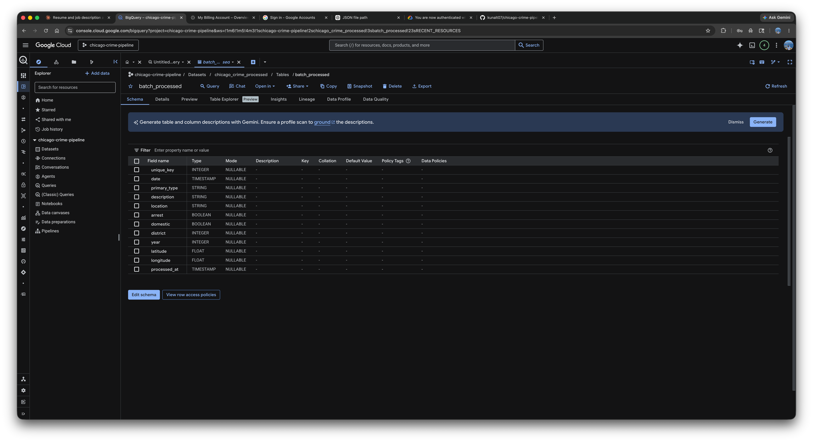
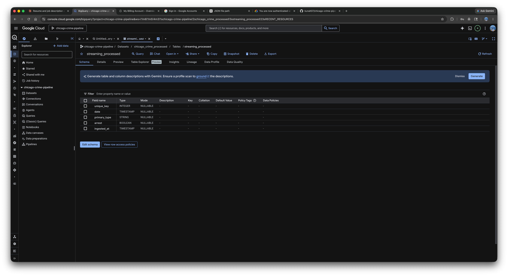
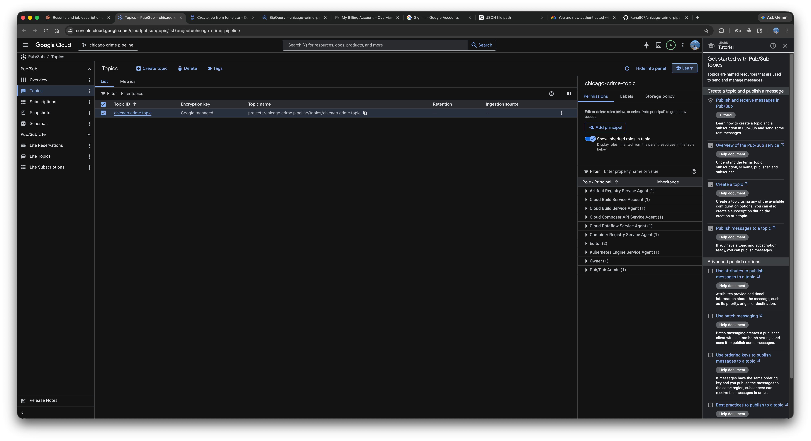
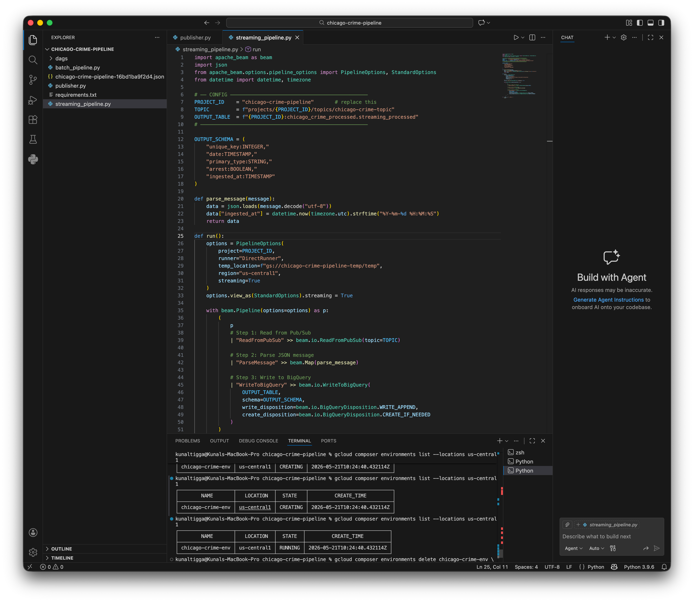
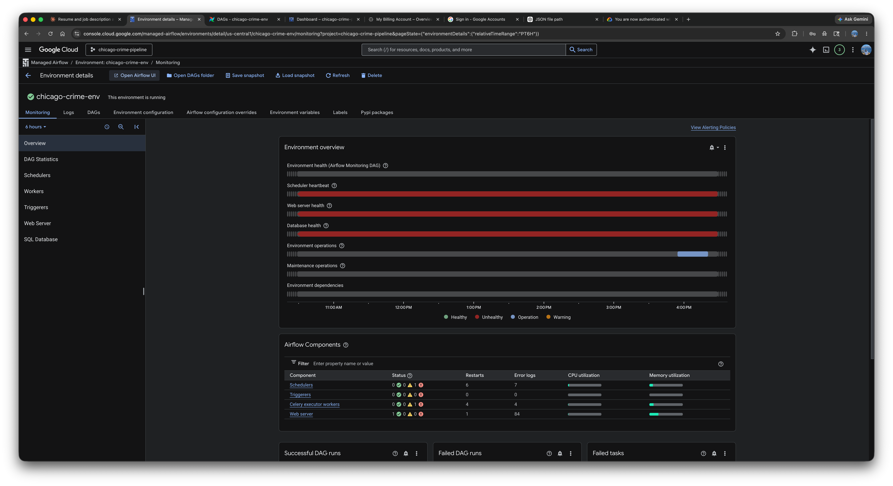
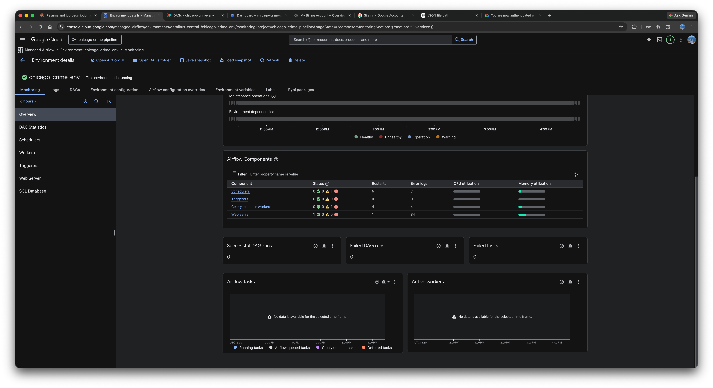
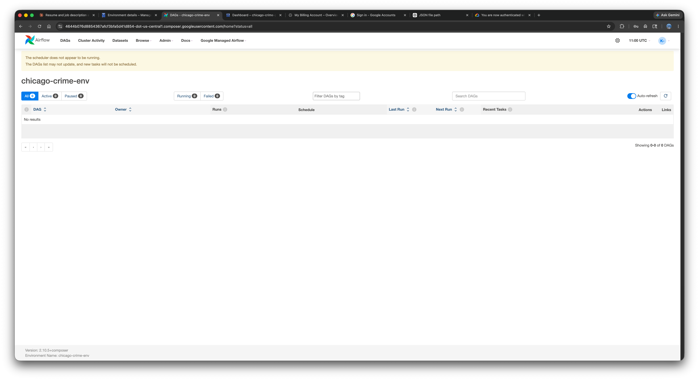

cat > README.md << 'EOF'
# Chicago Crime Data Pipeline — GCP

End-to-end data engineering project built on Google Cloud Platform, processing 
Chicago Police Department crime records using both batch and real-time streaming 
pipelines.

## Architecture Overview

- **Batch Pipeline** — Reads 1M+ records from BigQuery public dataset, applies data quality checks and transformations using Apache Beam, and loads clean data into a BigQuery table
- **Streaming Pipeline** — Simulates real-time crime event ingestion via Pub/Sub, processes messages through a Beam streaming pipeline, and writes to a separate BigQuery table with ingestion timestamps
- **Orchestration** — Cloud Composer (Airflow) DAG schedules the batch pipeline daily, managing dependencies and retry logic

## Tech Stack

| Tool | Purpose |
|---|---|
| BigQuery | Data warehouse — source and destination |
| Apache Beam (Python) | Batch and streaming transformations |
| Google Dataflow | Managed distributed Beam runner |
| Pub/Sub | Real-time message ingestion layer |
| Cloud Composer (Airflow) | Pipeline orchestration and scheduling |
| Cloud Storage | Temp storage for Dataflow jobs |

## Data Quality Steps

- Dropped records missing `unique_key`, `date`, or `primary_type`
- Standardized `primary_type` field to uppercase
- Replaced null location fields with `UNKNOWN`
- Added pipeline metadata timestamps (`processed_at`, `ingested_at`)

## Results

| Pipeline | Records Processed | Destination |
|---|---|---|
| Batch | 1M+ (2023 data) | `batch_processed` |
| Streaming | 50 simulated events | `streaming_processed` |

## Screenshots

### BigQuery — Batch Processed Table

### BigQuery — Streaming Processed Table

### Pub/Sub — Topic

### Cloud Composer — Run Process

### Cloud Composer — Environment Running

### Cloud Composer — Environment Running Detail

### Cloud Composer — Airflow UI

## Key Learnings

- Apache Beam PCollection model vs PySpark DataFrame approach
- Difference between batch and streaming pipeline configurations in Dataflow
- Pub/Sub message serialization and deserialization
- Cloud Composer DAG structure and scheduling
EOF